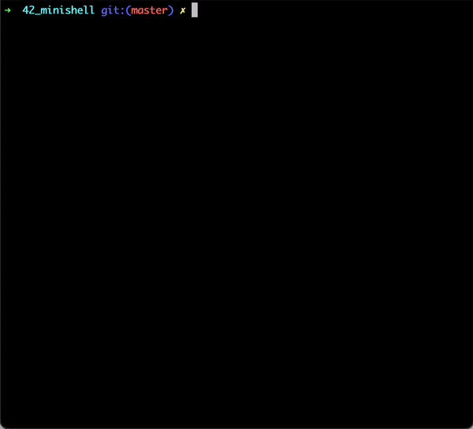

# 🐚 Minishell
A [42 school](https://42.fr/) project where you need to create a simple implementation of [Bash](https://en.wikipedia.org/wiki/Bash_(Unix_shell)) in C.  
  
📌 [Subject](https://github.com/celeloup/42_minishell/blob/master/fr.subject.pdf) (September 2020 version)    
By [amartin-menadier](https://github.com/amartin-menadier) and myself.

<p align="center">
  
</p>
  
## 🛠️ Usage
```shell
# Use our Makefile to compile
make

# Launch the shell
./minishell
```

## 🔍 Features

- Binary launch from `$PATH`
- Custom built-ins :   
  `echo` + `-n` option    
  `cd`    
  `pwd`  
  `export`   
  `unset`   
  `env`   
  `exit`  
- Command stacking using `;`
- Redirections (`>`, `>>`, `<`)
- Pipes (`|`)
- Environment variables (`$PATH`, `$?`, etc...)
- Signals handling (<kbd>Ctrl</kbd> + <kbd>C</kbd>, <kbd>Ctrl</kbd> + <kbd>D</kbd>, <kbd>Ctrl</kbd> + <kbd>\\</kbd>)

